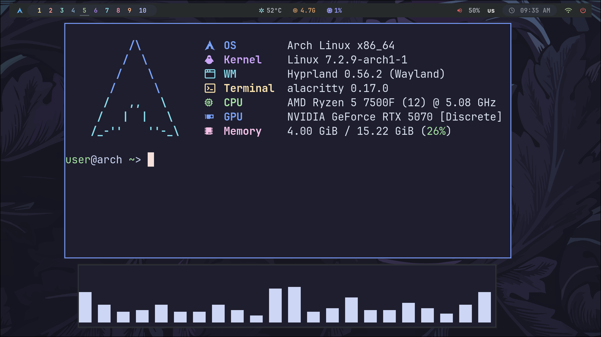
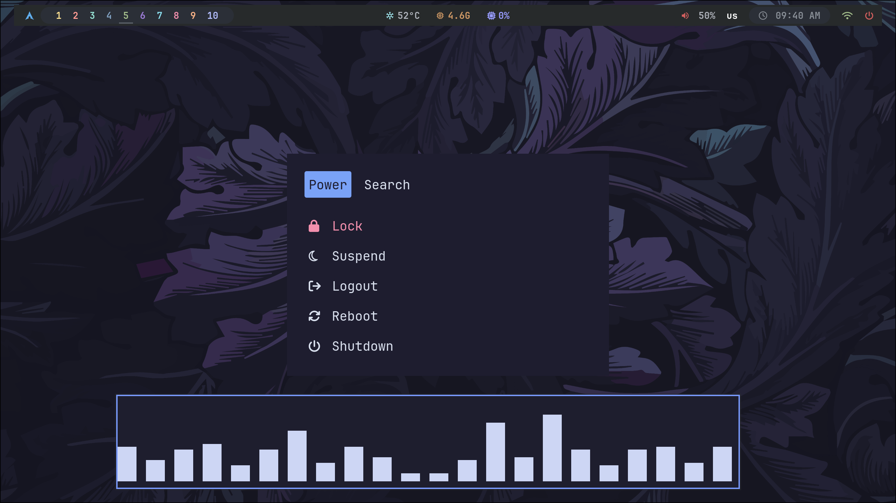
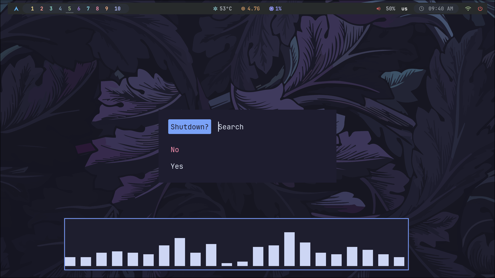
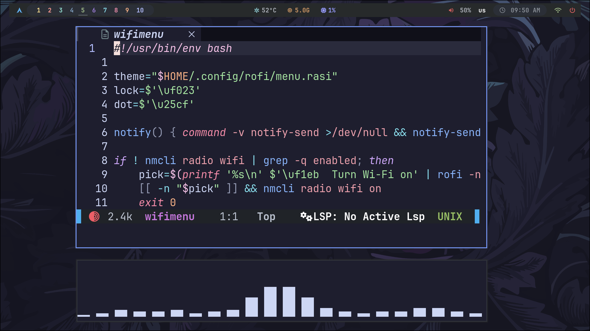

My personal Hyprland dotfiles for Arch Linux. 🐧

A clean and minimal Wayland setup with custom bars,
menus, notifications, OSD controls and everyday utilities.

## ✨ Screenshots

<div align="center">

<table>
<tr>
<td></td>
<td></td>
</tr>
<tr>
<td></td>
<td></td>
</tr>
</table>

</div>

## 🧩 Included

- 🪟 Hyprland
- 📊 Waybar
- 🚀 Rofi
- 🔔 SwayNC
- 🔊 SwayOSD
- 🔒 Hyprlock
- 🖼️ Hyprpaper
- 💻 Alacritty
- 🐟 Fish
- 📁 Thunar
- 📝 Neovim

## 🎨 Features

- Custom Waybar
- Application launcher
- Power menu
- Wi-Fi menu
- Notification center
- Volume and brightness OSD
- Custom lock screen
- Wallpaper setup
- Custom keybindings
- Startup configuration
- GTK configuration
- Screenshot workflow with Grim, Slurp and Satty
- XWayland configuration

## 🚀 Installation

```bash
git clone https://github.com/d1shburn/hyprland-dotfiles.git
cd hyprland-dotfiles
chmod +x install.sh
./install.sh
````

The installer installs the required packages and applies
the configuration to your home directory.

## 💡 Inspiration

The visual style of these dotfiles is based on
[Zproger's dotfiles for bspwm](https://github.com/Zproger/bspwm-dotfiles).

The original setup was built around bspwm and Polybar.
I recreated the visual style for Hyprland and Wayland,
rewriting the Polybar setup in Waybar and adapting the
configuration to the Hyprland ecosystem.
